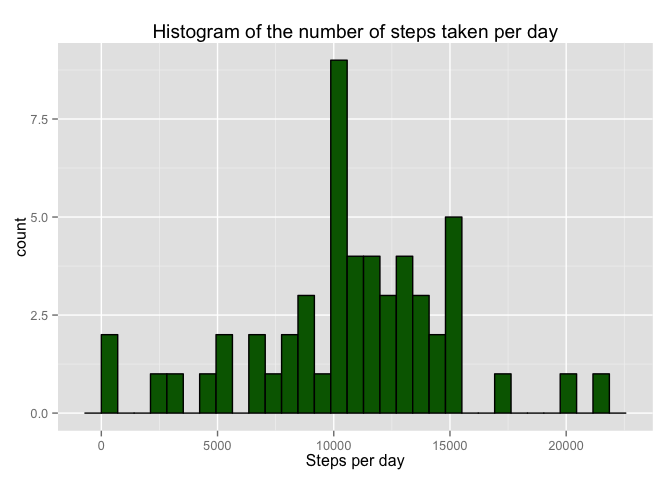
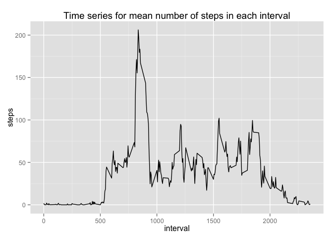
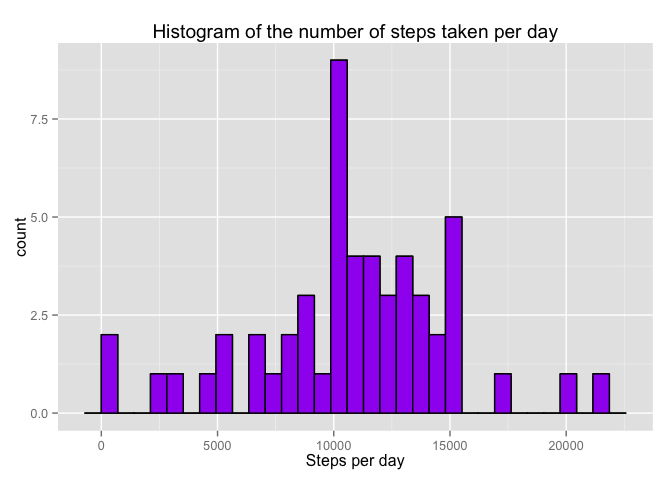
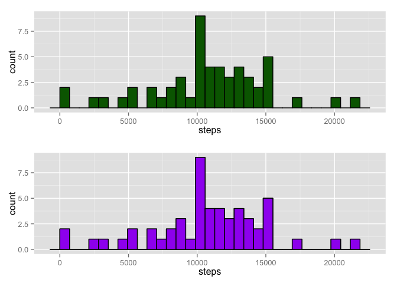
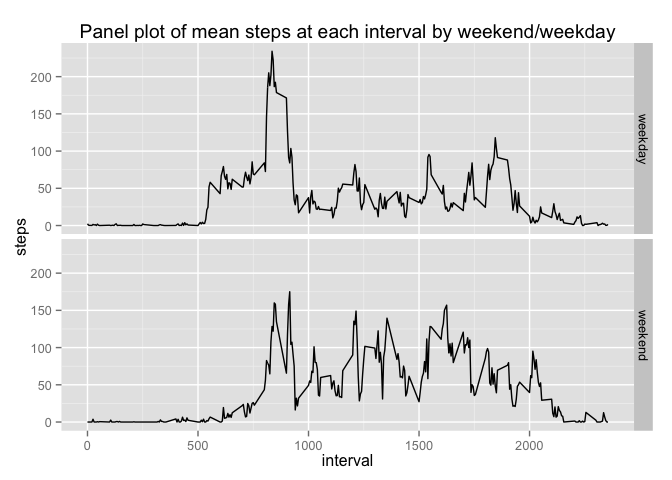

# Reproducible Research: Peer Assessment 1


## Loading and preprocessing the data

```r
library(utils) #load utils library that contains unzip function 
unzip("activity.zip") #extract activity.csv from zip container. 
df <- read.csv("activity.csv") #load csv into variable, "df"
```


## What is mean total number of steps taken per day?

```r
stepsPerDay <- aggregate(steps ~ date, df, FUN=sum) #sum the daily number of steps and store results in a new variable, "stepsPerDay""
colnames(stepsPerDay) <- c("date", "steps") #name columns for readability 

library(ggplot2) #load ggplot library for plotting
# plots the histogram of the steps taken per day
hist_with_NA_values <- ggplot(stepsPerDay, aes(x=steps))
hist_with_NA_values <- hist_with_NA_values + geom_histogram(fill="darkgreen", colour="black")
hist_with_NA_values + labs(title="Histogram of the number of steps taken per day", x="Steps per day")
```

 

```r
#calculate mean of steps taken per day, ignore days where values is NA. 
print (mean_with_NA_values <- mean(stepsPerDay$steps, na.rm=TRUE))
```

```
## [1] 10766.19
```

```r
#calculate median of steps taken per day, ignore days where values is NA.
print(median_with_NA_values <- median(stepsPerDay$steps, na.rm = TRUE))
```

```
## [1] 10765
```


## What is the average daily activity pattern?

```r
meanStepsAtEachInterval <- aggregate(steps ~ interval, df, FUN=mean) #calculate mean steps per interval and store in new variable, "meanStepsAtEachInterval"
 
#plot time series for numbers of steps in each 5 minute interval
qplot(interval, steps, data = meanStepsAtEachInterval, geom = "line", main="Time series for mean number of steps in each interval") 
```

 

```r
#identify which 5-minute interval has the max average number of steps across the dataset
meanStepsAtEachInterval[meanStepsAtEachInterval$steps==max(meanStepsAtEachInterval$steps), 1] 
```

```
## [1] 835
```

## Imputing missing values

```r
#Total number of missing values in the dataset 
length(df[is.na(df$steps),1])
```

```
## [1] 2304
```

```r
#Replace NA values with the mean value of the interval across the data collection period 
df$steps_with_imputted_missing_values = df$steps #Duplicate and work on new column so that we can preserve the original data
for ( i in 1:nrow(df) ) {
  if (is.na(df[i,"steps"])) {
    df[i,"steps_with_imputted_missing_values"] = 
      meanStepsAtEachInterval[meanStepsAtEachInterval$interval==df[i,"interval"],"steps"]
  }
}

stepsPerDay_with_imputted_missing_values = aggregate(steps_with_imputted_missing_values ~ date, df, FUN=sum) #sum the daily number of steps and store results in a new variable, "stepsPerDay""
colnames(stepsPerDay_with_imputted_missing_values) <- c("date", "steps") #name columns for readability 

# plots the histogram of the steps taken per day, with imputted values for NA
hist_with_imputted_values <- ggplot(stepsPerDay_with_imputted_missing_values, aes(x=steps))
hist_with_imputted_values <- hist_with_NA_values + geom_histogram(fill="purple", colour="black")
hist_with_imputted_values + labs(title="Histogram of the number of steps taken per day", x="Steps per day")
```

```
## stat_bin: binwidth defaulted to range/30. Use 'binwidth = x' to adjust this.
## stat_bin: binwidth defaulted to range/30. Use 'binwidth = x' to adjust this.
```

 

```r
#calculate mean of steps taken per day, with imputted values for NA
print( mean_with_imputted_values <- mean(stepsPerDay_with_imputted_missing_values$steps))
```

```
## [1] 10766.19
```

```r
#calculate median of steps taken per day, with imputted values for NA
print( median_with_imputted_values <- median(stepsPerDay_with_imputted_missing_values$steps))
```

```
## [1] 10766.19
```

### Comparison between analysis with and without imputted values

```r
#create matrix of values to be compared 
comparison <- rbind(  c(mean_with_NA_values, median_with_NA_values)
                    , c(mean_with_imputted_values, median_with_imputted_values)) 

colnames(comparison) <- c("mean", "median") #name columns 
rownames(comparison) <- c("Original (with NA values)", "With imputted values") #name rows
comparison #print comparison 
```

```
##                               mean   median
## Original (with NA values) 10766.19 10765.00
## With imputted values      10766.19 10766.19
```

```r
require(gridExtra) #load gridExtra library to help with arranging two ggplots 
grid.arrange(hist_with_NA_values, hist_with_imputted_values, ncol=1) #plot 
```

 

* There isn't any major differences when the imputed values are inserted over the NA values. The mean remains the same. The median value has increased slightly with the usage of imputed values.  
* The same of the histograms remain largely similar as well. However, if we haved used smaller bins, it might be possible to see differences where values in the x axis have been inserted in place of NA. 

## Are there differences in activity patterns between weekdays and weekends?


```r
df <- transform(df, date=as.Date(date)) #change class type to "Date" so that weekdays function can be used on column 
df$day <- weekdays(df$date) #create new column indicate the day of week for corresponding date

df_weekdays <- df[which(df$day != "Saturday" & df$day != "Sunday"), ] #subset data for weekdays
df_weekends <- df[which(df$day == "Saturday" | df$day == "Sunday"), ] #subset data for weekends

meanStepsAtEachInterval_weekday <- aggregate(steps ~ interval, df_weekdays, FUN=mean) #calculate mean steps per interval for weekdays
meanStepsAtEachInterval_weekend <- aggregate(steps ~ interval, df_weekends, FUN=mean) #calculate mean steps per interval for weekdays

meanStepsAtEachInterval_weekday$daytype <- "weekday" #populate daytype column with the type of day
meanStepsAtEachInterval_weekend$daytype <- "weekend" #populate daytype column with the type of day

meansStepsAtEachInterval_wkendwkday <- rbind(meanStepsAtEachInterval_weekend,meanStepsAtEachInterval_weekday) #form combined dataset

#meansStepsAtEachInterval_wkendwkday <- transform(meansStepsAtEachInterval_wkendwkday, daytype=as.factor(daytype))

#plot panel plot
pp <- ggplot(meansStepsAtEachInterval_wkendwkday, aes(x=interval, y=steps))
pp <- pp + geom_line() + labs(title="Panel plot of mean steps at each interval by weekend/weekday")
pp + facet_grid(daytype ~ .)
```

 
